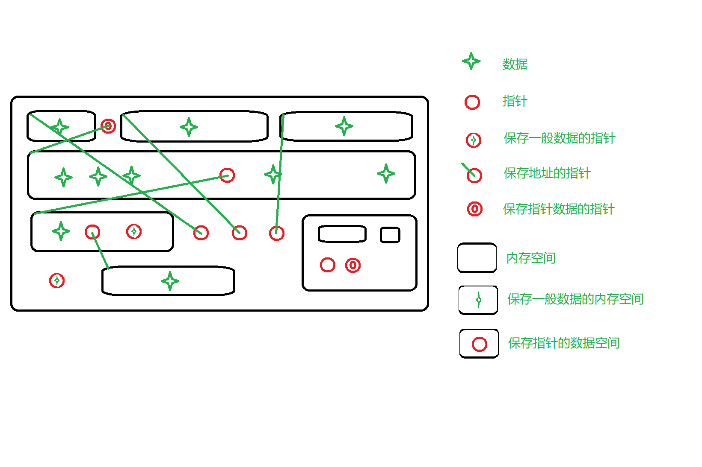

- 指针在使用上的一些考虑
    - 保存地址的指针，在使用时应由对应的实际空间支撑

数据、指针在内存中的情况：
 

- 链表中头节点添加长度变量的必要性？
- 链表结构体在分配空间结点的时候，结构体内部的指针是也被分配了空间？

Tips：

- 实际保存数据的时候（仅考虑内存），需要有实体的数据结构体标量，void *（指针）能增加扩展性，但是仍需要实际空间来保存数据。
- append函数动作包含了插入节点的动作，属于插入特殊位置节点的行为。为避免重复工作，在编程时的时候需要先考虑写公用方法。
- 多参考前人写的代码，对比思考。针对扩展性、效率、规范化、测试、注释重点考虑。